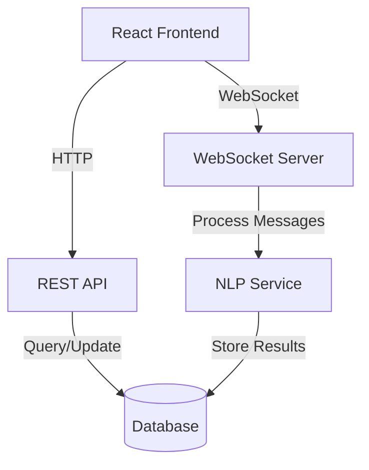
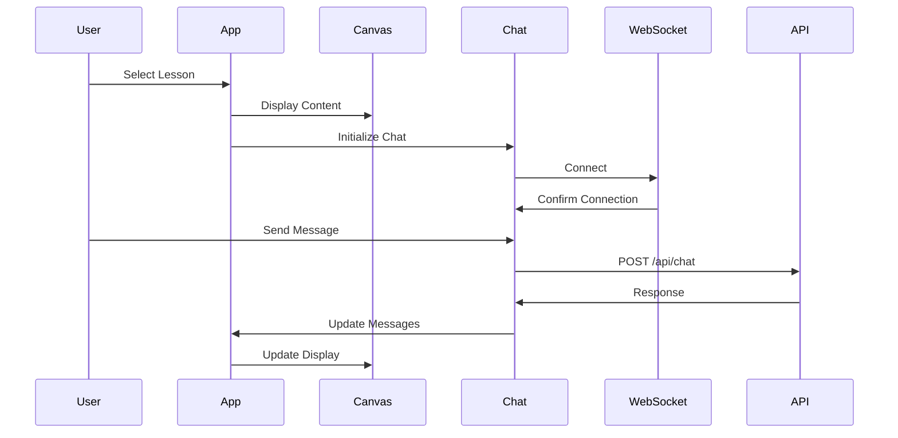
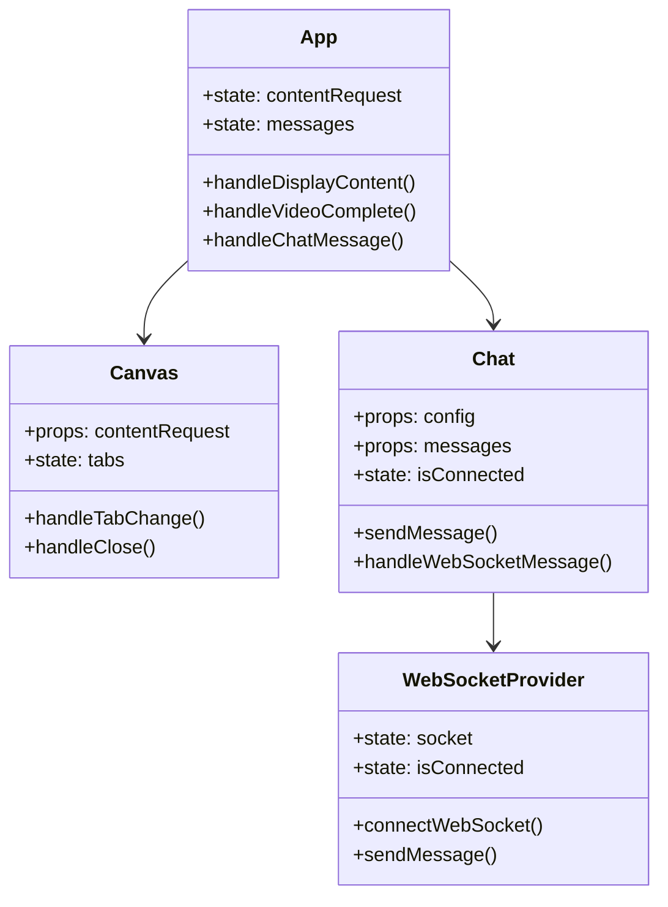

# AI Tutor Application Documentation

## Table of Contents
- [Overview](#overview)
- [Architecture](#architecture)
- [Technical Stack](#technical-stack)
- [Component Structure](#component-structure)
- [Setup Instructions](#setup-instructions)
- [Dependencies](#dependencies)

## Overview
This React-based application provides an interactive learning platform with real-time chat capabilities, video playback, and slide presentation features. The application supports multiple languages and includes speech recognition capabilities.

## Architecture

### System Architecture


### Component Flow


### Class Structure


## Technical Stack

### Core Technologies
- React 18.3.1
- TypeScript 4.9.5
- Vite 3.0.4 (Build Tool)

### UI Framework
- Material-UI (@mui/material) 6.1.5
- Material Icons (@mui/icons-material) 6.1.5

### State Management & Context
- React Context API for state management
- i18next for internationalization

### Communication
- WebSocket for real-time communication
- Axios 1.7.7 for HTTP requests

## Dependencies

### Production Dependencies
```json
{
  "@emotion/react": "11.13.3",
  "@emotion/styled": "11.13.0",
  "@mui/icons-material": "6.1.5",
  "@mui/material": "6.1.5",
  "@types/socket.io-client": "3.0.0",
  "axios": "1.7.7",
  "i18next": "23.16.4",
  "i18next-browser-languagedetector": "8.0.0",
  "qrcode.react": "4.1.0",
  "react": "18.3.1",
  "react-dom": "18.3.1",
  "react-i18next": "15.1.0",
  "react-markdown": "9.0.1",
  "socket.io-client": "4.8.0"
}
```

### Development Dependencies
```json
{
  "@types/node": "22.7.9",
  "@types/react": "18.3.12",
  "@types/react-dom": "18.3.1",
  "@types/youtube": "0.1.0",
  "@typescript-eslint/eslint-plugin": "8.11.0",
  "@typescript-eslint/parser": "8.11.0",
  "@vitejs/plugin-react": "2.0.0",
  "eslint": "9.13.0",
  "eslint-plugin-react": "7.37.2",
  "eslint-plugin-react-hooks": "5.0.0",
  "nodemon": "3.1.7",
  "prettier": "3.3.3",
  "typescript": "4.9.5",
  "vite": "3.0.4"
}
```

## Component Structure

### Main Components
- `App`: Root component managing overall layout and state
- `Canvas`: Handles video and slide display
- `Chat`: Manages chat interface and WebSocket communication
- `ControlPane`: Controls for lesson playback and settings
- `AudioPlayer`: Handles audio playback for narratives

### Context Providers
- `WebSocketProvider`: Manages WebSocket connections
- `LectureProvider`: Handles lecture data and state
- `I18nextProvider`: Manages internationalization

## Setup Instructions

1. Clone the repository
```bash
git clone [repository-url]
```

2. Install dependencies
```bash
npm install
```

3. Start development server
```bash
npm run dev
```

4. Build for production
```bash
npm run build
```

## Environment Configuration

Create a `.env` file in the root directory:

```env
VITE_API_URL=https://your-api-url
VITE_WS_URL=wss://your-websocket-url
```

## Features

### Core Features
- Real-time chat with AI tutor
- Multi-language support (Armenian, English, German)
- Video playback integration
- Slide presentation
- Speech recognition
- QR code generation for homework

### Additional Features
- File upload capabilities
- Audio playback for narratives
- Fullscreen mode
- Progress tracking
- Responsive design

## Contributing

1. Fork the repository
2. Create a feature branch
3. Commit changes
4. Push to the branch
5. Create a Pull Request

## License

This project is licensed under the ISC License.